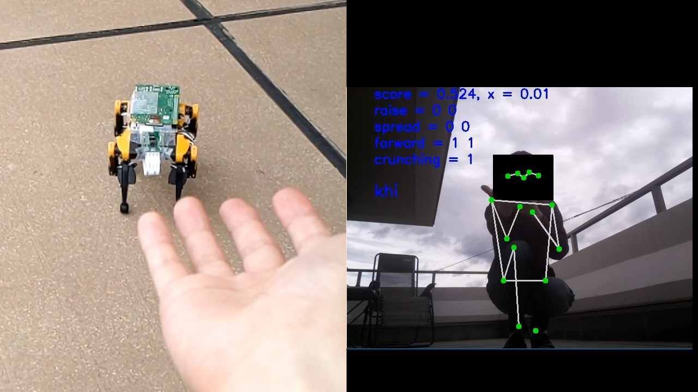
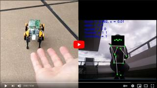
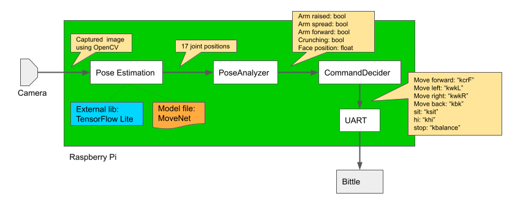

# Petoi Bittle Controlled by Pose
- A project to control Petoi Bittle using human pose
- Human pose is estimated using MoveNet and TensorFlow Lite



## YouTube
[](https://www.youtube.com/watch?v=ZRhm6DueARo)


## System overview



## Components
- Petoi Bittle
    - https://www.petoi.com/
    - How to assemble: https://bittle.petoi.com/
    - Solder a 2x5 socket on NyBoards
- Raspberry Pi 4
    - 2021-05-07-raspios-buster-arm64
    - enable VNC, CAMERA, UART (but disable UART console)
    - Install OpenCV (self build needed)
- Raspberry Pi Camera v2.1

## How to Run
- Connect the Raspberry Pi 4 and Petoi Bittle
- Build the project and run it

```
git clone https://github.com/iwatake2222/bittle_controlled_by_pose.git
cd bittle_controlled_by_pose
git submodule update --init --recursive
cd InferenceHelper/ThirdParty/tensorflow
chmod +x tensorflow/lite/tools/make/download_dependencies.sh
tensorflow/lite/tools/make/download_dependencies.sh

mkdir build && cd build
cmake ..
make
./main
```

## Warning
- It gets super hot !!

# License
- bittle_controlled_by_pose
- https://github.com/iwatake2222/bittle_controlled_by_pose
- Copyright 2021 iwatake2222
- Licensed under the Apache License, Version 2.0

# Acknowledgements
- TensorFlow
    - https://github.com/tensorflow/tensorflow
    - Copyright 2019 The TensorFlow Authors
    - Licensed under the Apache License, Version 2.0

- lite-model_movenet_singlepose_lightning_3.tflite
    - https://tfhub.dev/google/lite-model/movenet/singlepose/lightning
    - Licensed under the Apache License, Version 2.0

- pictures
    - <a href="https://www.pakutaso.com" title="フリー写真素材ぱくたそ" >フリー写真素材ぱくたそ </a>


